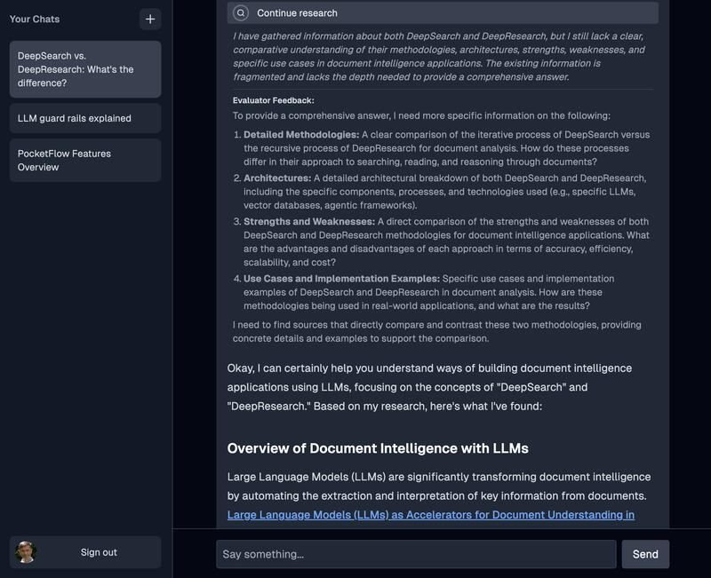
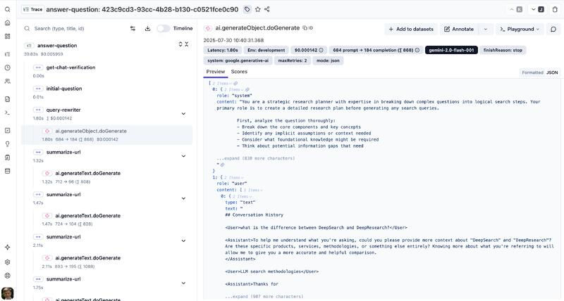
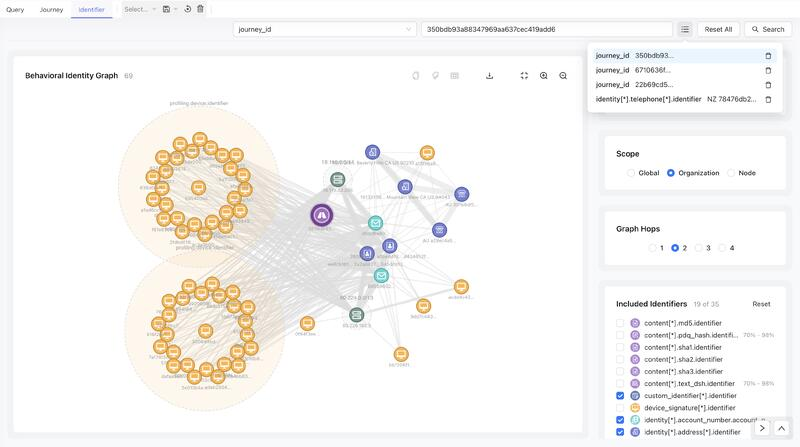
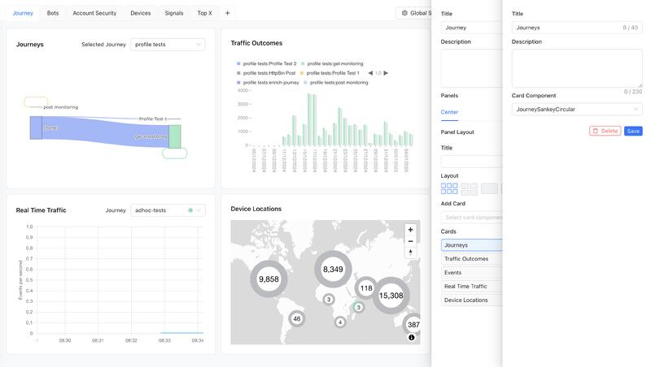
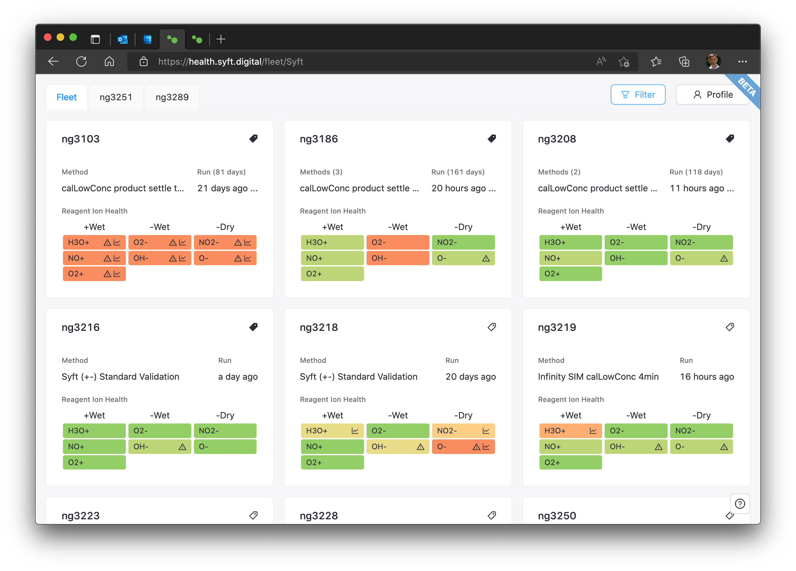
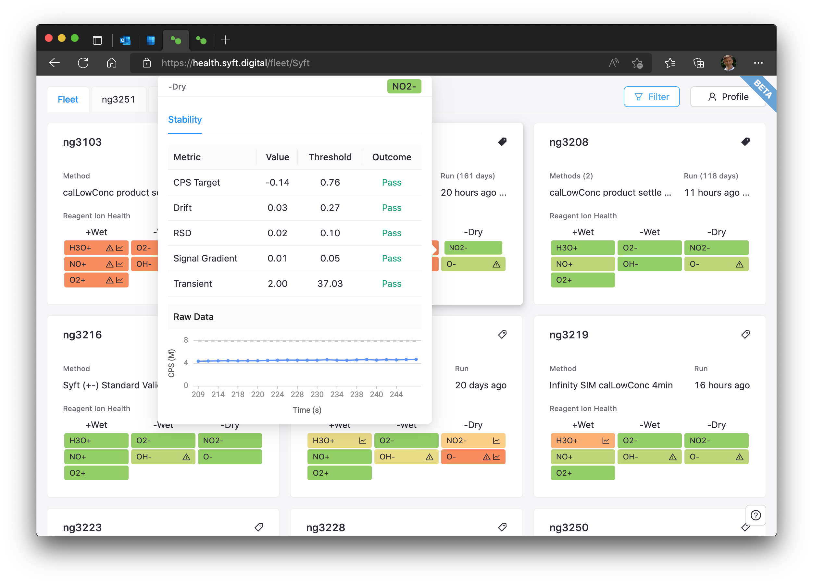
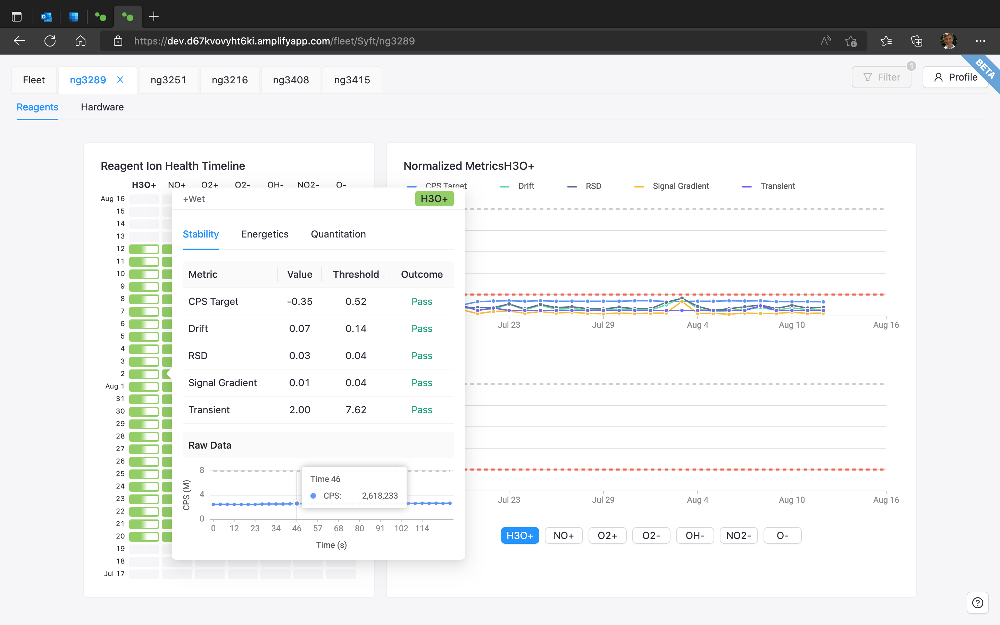
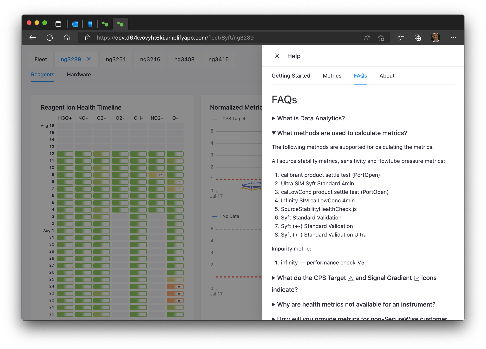
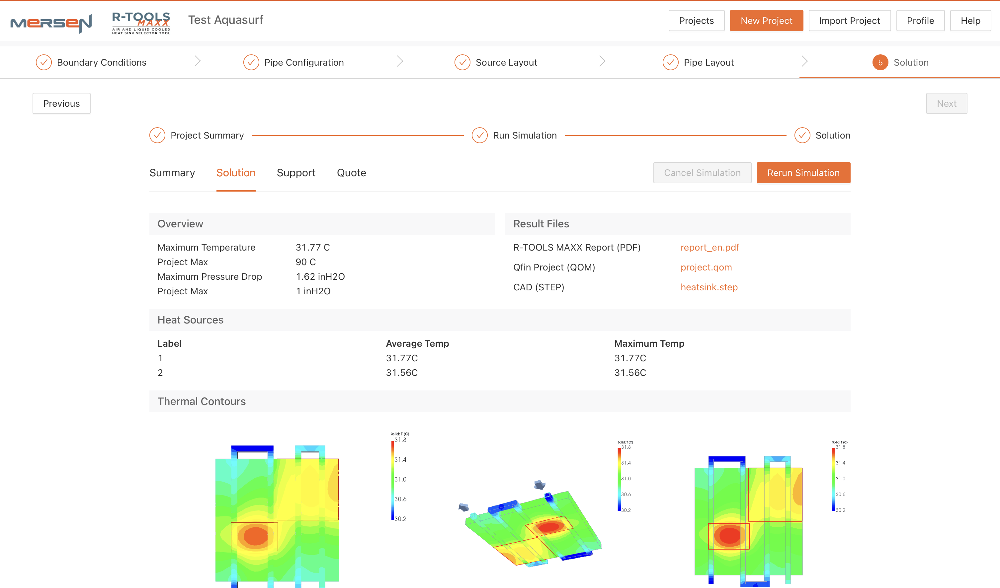

# Example Projects

Examples of applications and components I've built:

- **Deep Search**: AI deep search with rate-limiting, prompt management, evaluations, and observability.
- **Darwinium Frontend**: Fraud detection UI with interactive dashboards and network graphs.
- **Syft Instrument Health**: Mass Spectrometry instrument performance monitoring.
- **Mersen R-TOOLS MAXX**: Heat sink design and thermal simulation tool.

## Deep Search

AI deep search with rate-limiting, prompt management, evaluations, and observability.

Tech Stack: React, Next.js, AI SDK, Tailwind CSS, Postgres, Redis

LinkedIn Article: [Building a Production-Ready Deep Search Application: Architecture, Evals, and Telemetry](https://www.linkedin.com/pulse/building-production-ready-deep-search-application-evals-steenkamp-dbsyc/)

**Deep Search Sources** — Expandable showing sources scraped for detailed information.

**Deep Search Research** — Expandable showing LLM response with planned actions.

**Deep Search Answer** — Final answer with links for reference sources.

**Deep Search Local Evals** — Local evals run on your development server and make iteration quick and easy.

 **Deep Search Engineering Observability** — Platform provides continuous observability with traces, evals and provides prompt management and metrics for continual improvement.

## Darwinium Frontend

Fraud detection UI with interactive dashboards and network graphs. Views and components built for Darwinium Aphex frontend application.

Tech Stack: React, CSS modules, Node.js GraphQL API.

**Identity Graph** — Interactive Network Graphs with custom nodes, grouping, linking and filtering.

**Dashboard Cards** — Configurable cards allow selecting custom data rendering components for each card.

**Dashboard Layout** — Multiple dashboards are supported using tabs. Each dashboard has user configurable resizable panels and tab layouts. Panels have user configurable card layouts and card positioning.

## Syft Instrument Health

Mass Spectrometry instrument performance monitoring. Data is ingested from instruments deployed in the field using Apache NiFi (IoT) and processed on AWS data stack.

Tech Stack: React (AWS Amplify), Python GraphQL API, AWS data stack

**Instrument Fleet** — Cards provide a quick visual overview of the health of all instruments deployed in the fleet.

**Instrument Quick View** — Easily see more details for the reagent of a specific instrument from the fleet list view.

**Instrument Details** — Selecting an instrument from the fleet view opens a new instrument tab with performance timeline, detail for timeline segment, and hardware information.

**Help Panel** — Help information easily updated and tailed for specific customers, fleets and types of instrument.

## Mersen R-TOOLS MAXX

[R-TOOLS MAXX Air and Liquid Cooled Heat Sink Selector Tool](https://www.mersen.com/en/resources/r-tools-maxx-air-and-liquid-cooled-heat-sink-selector-tool) is an online tool for designing and simulating the performance of air and liquid-cooled heat sinks.

Tech Stack: React (AWS Amplify), Cognito, S3, DynamoDB, Lambda

**Projects List** — List of all the user's designs and summary of key parameters

**Heat Source Layout** — Specify the size and parameters of heat sources, add and remove heat sources, drag to position.

**Mechanically Bonded Fin Selector** — The fin selector recommends suitable heat sink extrusions from the specified the heat sources and flow conditions.

**Mechanically Bonded Fin Thermal Simulation** — Simulations run on separate EC2 servers and depending on the design complexity may take minutes to complete. Users can continue with other designs and come back to review the completed simulation.

**AquaFlow Pipe Layout** — AquaFlow heatsinks have embedded coolant pipes in the heat sink base. Users can add and remove pipes, position them and set the flow direction.

**AquaFlow Thermal Simulation** — Simulations run on separate EC2 servers and depending on the design complexity may take minutes to complete. Users can continue with other designs and come back to review the completed simulation.
