# Example Projects

Some examples of applications and components I've built.
## Deep Search

[Building a Production-Ready Deep Search Application: Architecture, Evals, and Telemetry](https://www.linkedin.com/pulse/building-production-ready-deep-search-application-evals-steenkamp-dbsyc/)

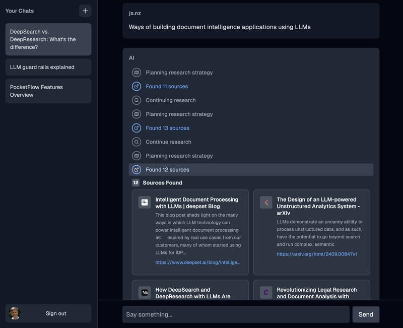

**Deep Search Sources** — Expandable showing sources scraped for detailed information

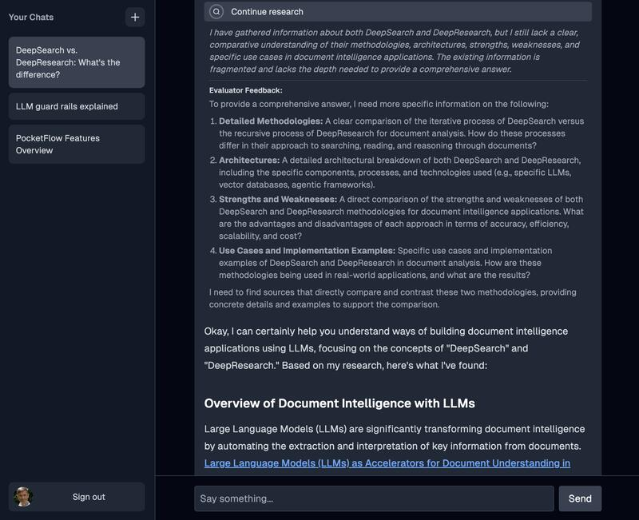

**Deep Search Research** — Expandable showing LLM response with planned actions

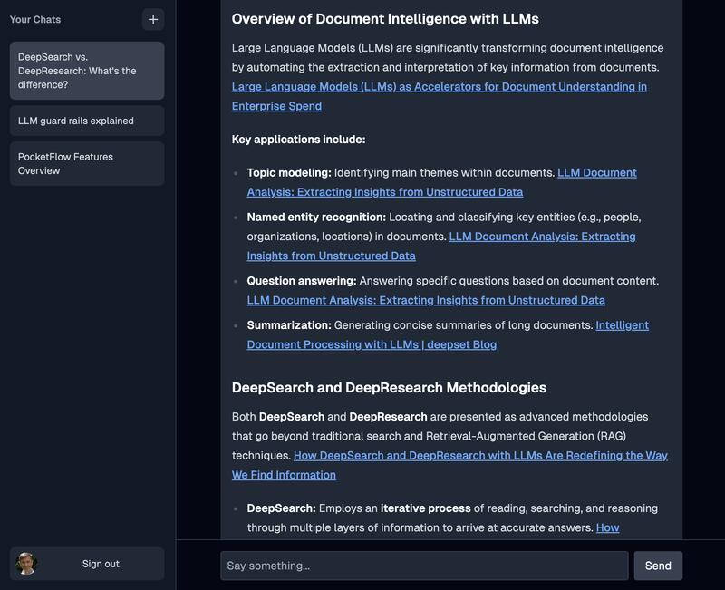

**Deep Search Answer** — Final answer with links for reference sources

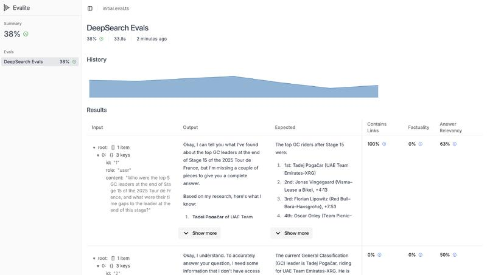

**Deep Search Local Evals** — Local evals run on your development server and make iteration quick and easy.

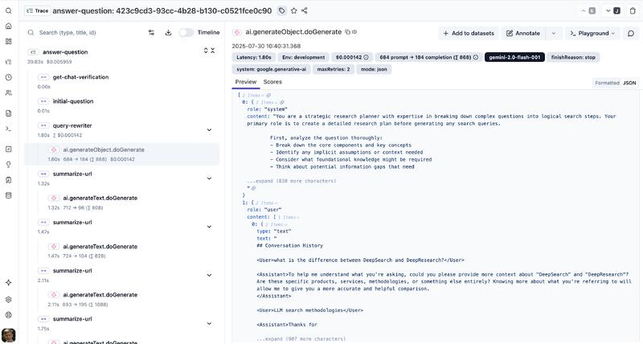

 **Deep Search Engineering Observability** — Platform provides continuous observability with traces, evals and provides prompt management and metrics for continual improvement.

## Darwinium Frontend

Views and components built for Darwinium Aphex frontend application.

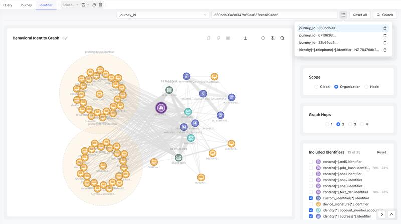

Interactive Network Graphs with custom nodes, grouping and filtering

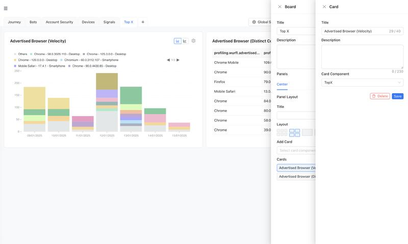

Dashboard Cards with configurable components including data selectioon and filtering, chart types and data grids

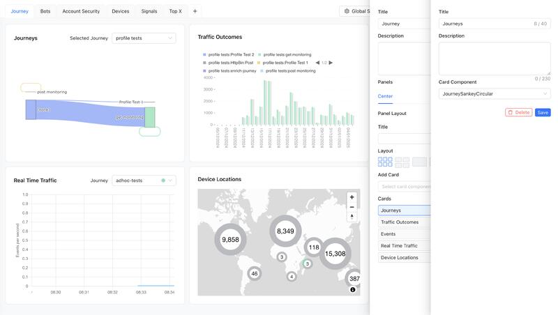

Dashboards with user configurable tabs, resizable panels, panel layouts, and dashboard tab layouts

## Mersen R-TOOLS MAXX

[R-TOOLS MAXX Air and Liquid Cooled Heat Sink Selector Tool](https://www.mersen.com/en/resources/r-tools-maxx-air-and-liquid-cooled-heat-sink-selector-tool) is a online tool for designing and simulating the performance of air and liquid-cooled heat sinks.

AWS tech stack: Amplify (React), Cognito, S3, DynamoDB, Lambda

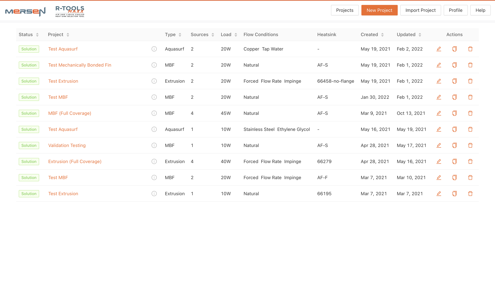

Projects List

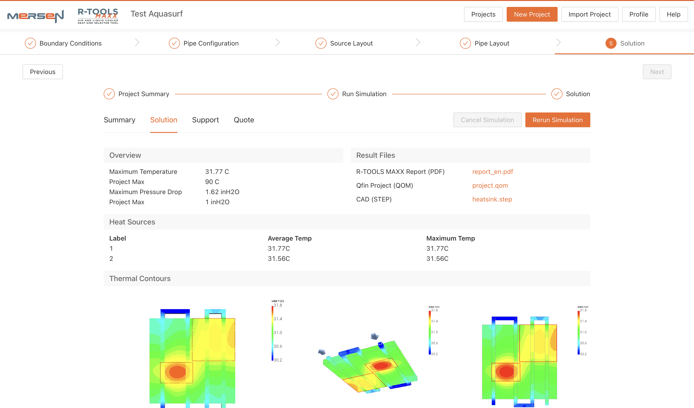

Thermal simulation of AquaFlow pipes

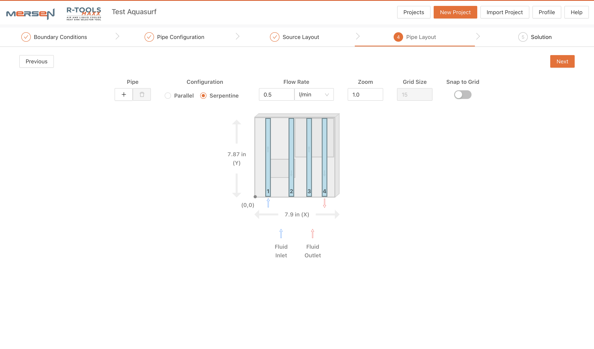

AquaFlow pipe layout

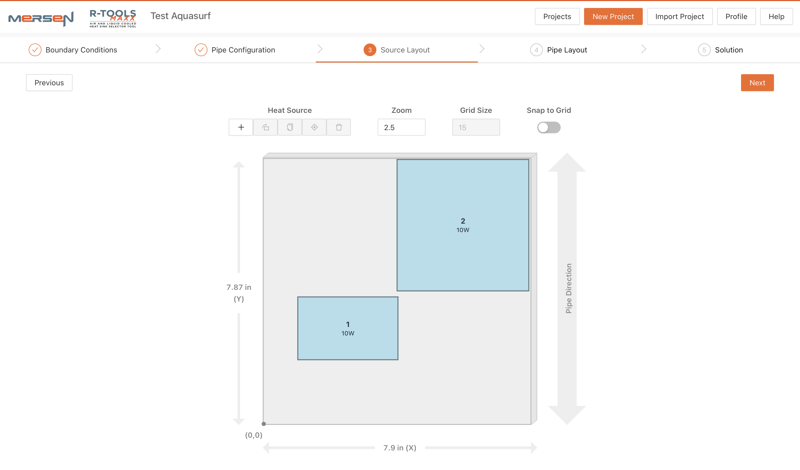

AquaFlow heat source layout

Mechanically Bonded Fin Selector

Mechanically Bonded Fin thermal simulation
